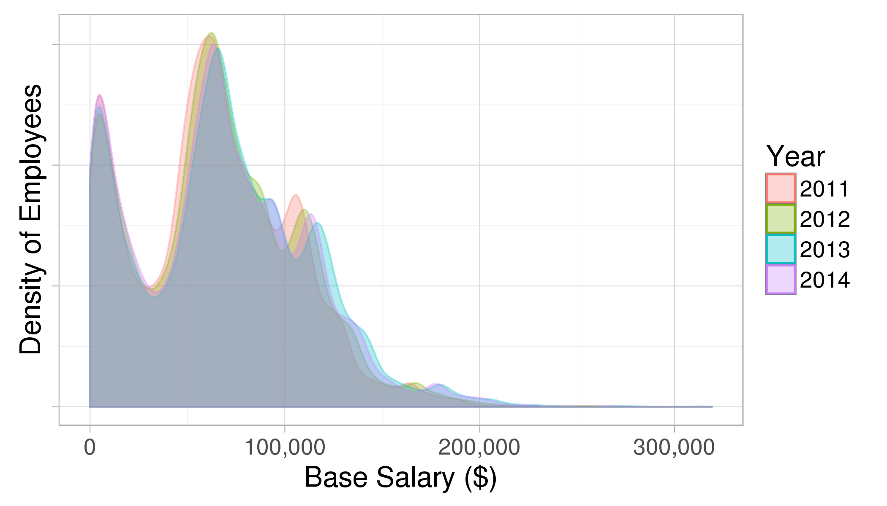

# San Francisco Salaries Kaggle Dataset

## Dataset
- [SF Salaries | Kaggle](https://www.kaggle.com/kaggle/sf-salaries)

Explore San Francisco city employee salary data

## Data Description
- Salaries.csv: SF city salaries from 2011-2014
	- original data source: [salaries for San Francisco | Transparent California](https://transparentcalifornia.com/salaries/san-francisco/)

> One way to understand how a city government works is by looking at who it employs and how its employees are compensated. This data contains the names, job title, and compensation for San Francisco city employees on an annual basis from 2011 to 2014.  

*Figure:* [Exploring the SF City Salary Data | Kaggle](https://www.kaggle.com/benhamner/exploring-the-sf-city-salary-data)

## Exploration Ideas

- How have salaries changed over time between different groups of people?
- How are base pay, overtime pay, and benefits allocated between different groups?
- Is there any evidence of pay discrimination based on gender in this dataset?
- How is budget allocated based on different groups and responsibilities?
